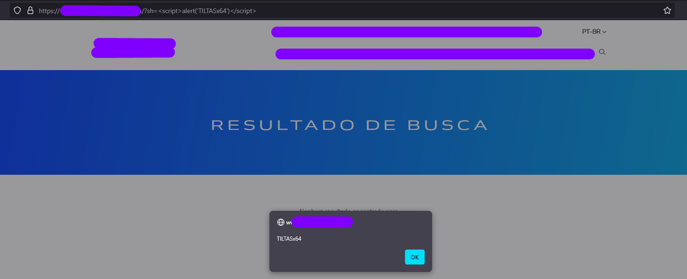

# Meu primeiro RXSS

---

### RXSS — Minha Primeira Vulnerabilidade Oficial

**Um Passo Significativo na Minha Jornada em CyberSecurity 🚀**

**publicado:** 3 de fevereiro de 2025

**tempo de leitura:** 5 minutos

Hoje, quero compartilhar um marco na minha carreira em CyberSecurity: identifiquei minha primeira vulnerabilidade oficial, uma Reflected Cross-Site Scripting (RXSS). 🚀

## O que é RXSS?

⚪ Explicando de forma simples e direta o que é RXSS.

— A vulnerabilidade Reflected Cross-Site Scripting (RXSS) acontece quando um site “reflete” algo que você digitou ou clicou, sem verificar se aquilo é seguro. Isso pode permitir que alguém malicioso envie um link especial para você. Quando você clica, o site executa um código oculto que pode, por exemplo, roubar suas informações ou fazer algo no site como se fosse você.

⚪ Exemplo simples.

— Imagine que você está em um mecanismo de busca. Você digita “pizza” e o site responde com “Resultados para pizza”. Se o site não verificar o que você digitou, alguém pode criar um link malicioso que, em vez de buscar por “pizza”, envie um código para roubar suas informações. E como o site exibe isso de volta sem verificar, o código acaba sendo executado no seu navegador.

⚪ Como evitar isso?

— Os sites podem corrigir isso validando tudo o que recebem antes de exibir de volta. Dessa forma, garantem que apenas conteúdos seguros sejam mostrados.

A vulnerabilidade existe com certeza no vBulletin versão 4.2.3, então usaremos essa versão nas referências a seguir. O ponto de entrada para essa PHP Object Injection, a chamada vulnerável da função **unserialize()** do PHP, está localizada dentro do script **/private.php**:

## Qual foi sua análise inicial e o que despertou sua curiosidade/insight para descobrir a vulnerabilidade? E quando o pop-up apareceu, qual foi a reação?

— Começando pela minha análise inicial: eu comecei pelo site mesmo, até porque sou “curioso” (e precisamos ser curiosos). Como atualmente estou vendo alguns conteúdos e estudos sobre Web Attack, comecei por ali, com o que eu já tinha até então. Passei a analisar o comportamento do site, navegando por todas as abas, botões, formulários, buscas, até que… Em uma dessas telas comecei a inserir payloads, mesmo sem forçar muito a página, até que consegui alterar pelo payload utilizado (print abaixo).

```bash
// Payload utilizado
"<script>alert("TILTASx64")</script>"
```



*“Entrei em choque quando apareceu o pop-up 😁” — Vou deixar aqui uma pequena evidência: um print com minha tag "TILTASx64", simbolizando esse momento especial.*

— Então… BOOM, o pop-up na minha tela. Eu travei na hora 😅 Não conseguia acreditar no que estava vendo, porque era minha primeira descoberta. Testei novamente para ter certeza, em outro navegador (ainda incrédulo) e BOOM, pop-up na tela de novo.

— Com medo de ter feito algo errado, até porque é um projeto privado, fui conversar com o responsável pelo projeto para informar a descoberta que eu havia acabado de fazer.

— E basicamente esse foi o processo desde o momento em que o projeto me foi apresentado e eu fui incluído nele.

Vou continuar evoluindo e contribuindo para enfrentar os desafios da segurança no mundo digital.

Espero ter contribuído de alguma forma.

Nos vemos! 🚀